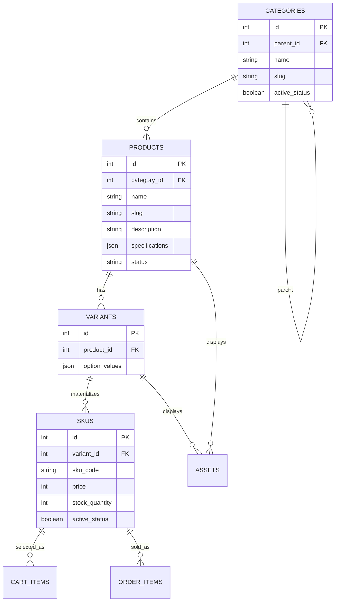

# Sprint 2: Catalog Data Foundation

## 1. Sprint Goal and Scope Boundary
**Sprint Goal:** Given a product catalog administrator, the system must persist categories, products, variants, and SKUs without losing identity, relationship, price, or inventory meaning.  
**Duration:** 15 calendar days.

**In Scope:**
* Category tree management with stable identifiers and slugs.
* Product creation and editing, including status and descriptive content.
* Variants and SKU records with unique codes, price, stock, and availability.
* Basic authenticated administration for categories, products, variants, and SKUs.
* Database constraints, migrations, seed data, and focused tests.

**Out of Scope:**
Dynamic specifications, asset upload, public catalog search, publication workflows, payment gateway integration, order placement, shipping integration, and the complete shopper checkout flow belong to Sprint 3 or later.

## 2. Link to Sprint 1 Decisions
Sprint 2 reuses the core architectural pillars established in Sprint 1 while refactoring the inventory boundary to support multi-tier catalog modeling:
* **Tech Stack:** Next.js (Frontend), FastAPI (Backend), and PostgreSQL (Database) remain fully consistent with Sprint 1.
* **Domain Adaptation:** Sprint 1 modeled books as single-copy `LISTINGS` with an `is_available` boolean. Sprint 2 expands this into a structured **Product -> Variant -> SKU** hierarchy to support professional e-commerce requirements without breaking foreign-key relationships to `CART_ITEMS` and `ORDER_ITEMS`.
* **Money Representation:** Floating-point money is strictly rejected in favor of integer minor units (cents).

## 3. Updated ERD and Data Dictionary
The relational schema extends the Sprint 1 ERD to incorporate hierarchical categories, variants, and granular SKUs.

**Data Dictionary:**
* **Categories:** `id` (PK), `parent_id` (FK, ON DELETE SET NULL), `name`, `slug` (UNIQUE), `active_status`, `created_at`.
* **Products:** `id` (PK), `category_id` (FK, ON DELETE RESTRICT), `name`, `slug` (UNIQUE), `description`, `status`, `specifications` (JSON), `created_at`.
* **Variants:** `id` (PK), `product_id` (FK, ON DELETE CASCADE), `option_values` (JSON).
* **SKUs:** `id` (PK), `variant_id` (FK, ON DELETE CASCADE), `sku_code` (UNIQUE), `price` (INTEGER cents), `stock_quantity` (CHECK >= 0), `active_status`.
* **Assets:** `id` (PK), `product_id` / `variant_id` (FK), `storage_url`, `alt_text`, `sort_order`.

## 4. Administration Route Table
The administrative backend implements protected CRUD operations:

| Method | Route | Purpose | Authentication |
| :--- | :--- | :--- | :--- |
| **POST** | `/api/v1/admin/products` | Create a draft product | Admin Only |
| **PATCH** | `/api/v1/admin/products/:id` | Update product content or status | Admin Only |
| **POST** | `/api/v1/admin/products/:id/skus` | Add a validated SKU to a product | Admin Only |
| **PATCH** | `/api/v1/admin/skus/:id` | Update SKU price, stock, or status | Admin Only |
| **GET** | `/api/v1/admin/products` | Return administrative product records | Admin Only |
| **POST** | `/api/v1/admin/categories` | Create a category (slug & cycle checks) | Admin Only |
| **GET** | `/api/v1/admin/categories` | Return the category tree | Admin Only |

## 5. Data Integrity and Authorization Decisions
* **Uniqueness & Constraints:** PostgreSQL enforces database-level `UNIQUE` constraints on slugs and SKU codes, along with a `CHECK (stock_quantity >= 0)` rule to prevent negative inventory. API validation alone is not relied upon.
* **Business Rules Answered:**
  1. *Draft Products:* Can exist without SKUs, but publishing requires at least one active sellable SKU.
  2. *Categories:* Single canonical category relationship (`category_id`) per product for clean MVP navigation.
  3. *Parent Deactivation:* Recursively hides child nodes from public views while retaining integrity.
  4. *Out of Stock:* Retained with `stock_quantity = 0` or `active_status = false`.
  5. *Pricing:* Isolated per SKU, acting as a direct condition/edition price override.
  6. *Historical Orders:* Protected against deletion via `ON DELETE RESTRICT` foreign key bindings on order/cart associations.

## 6. Seed-Data and Demonstration Instructions
* **Included Fixtures (`scripts/seed_catalog.py`):** 2 category levels, 3 products (including multi-variant titles), 4 active SKUs, and 1 zero-stock/unavailable combination.
* **Execution steps:**
  1. Set environment: `export PYTHONPATH=.`
  2. Populate seed data: `python3 scripts/seed_catalog.py`
  3. Start FastAPI server: `uvicorn main:app --reload`
  4. Access Swagger documentation at `http://127.0.0.1:8000/docs`.

## 7. Test Strategy, Command, and Result
* **Test Framework:** `pytest` with `FastAPI TestClient` covering validation failures, conflict rejections, and authorization boundaries.
* **Command:** `PYTHONPATH=. pytest tests/ -v`
* **Results:** Successfully verified that duplicate SKU codes return a `409 Conflict` response instead of server tracebacks, and negative stock updates trigger a `422 Unprocessable Entity` validation rejection. All tests PASSED.

## 8. Known Limitations and Sprint 3 Backlog
* **Asset Uploads:** The `ASSETS` table schema is provisioned in the database, but full image uploading and storage bucket integration are deferred to Sprint 3.
* **Public Storefront:** Public catalog browsing endpoints and dynamic specification filters will be constructed in Sprint 3 on top of this stable database foundation.
